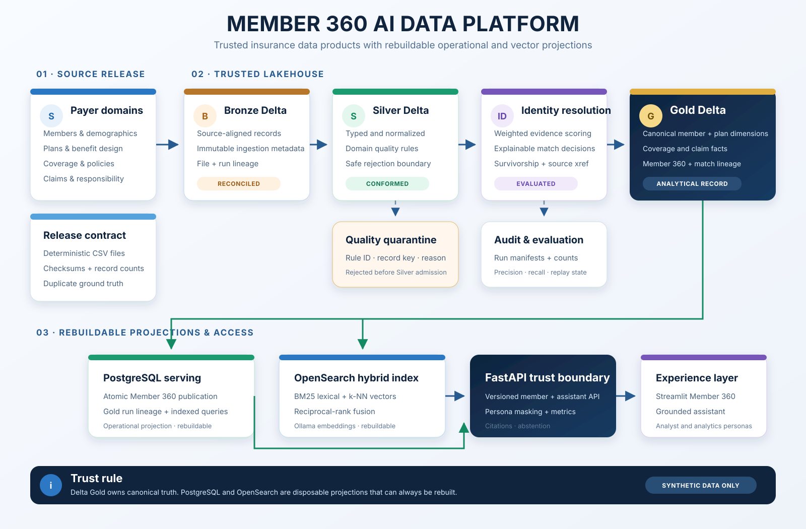
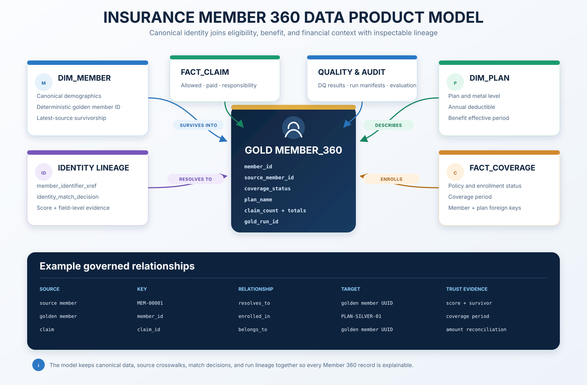
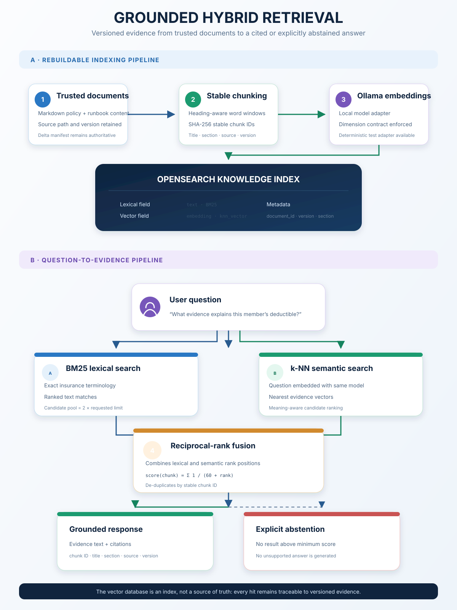
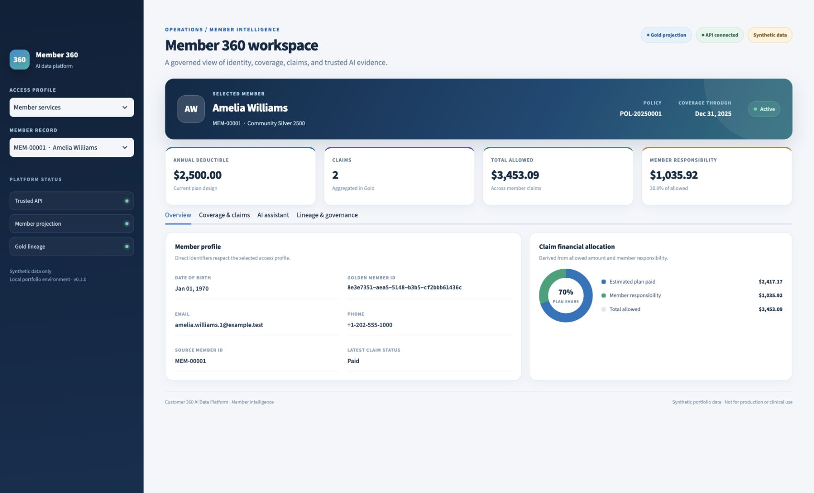
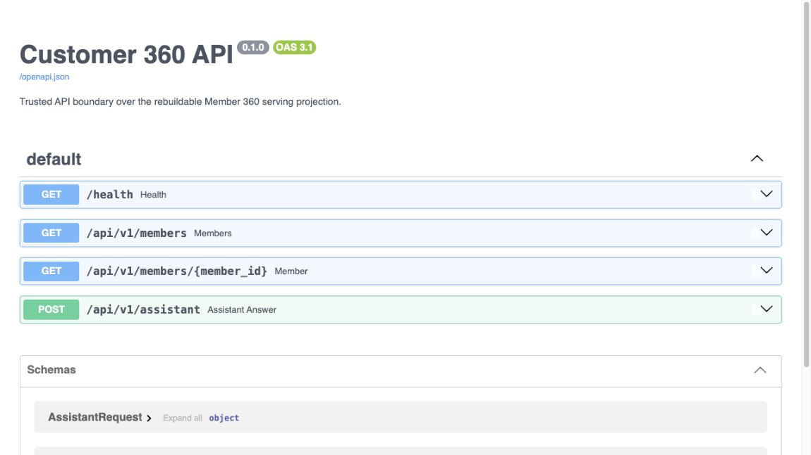

# Customer 360 AI Data Platform

A reproducible US health-insurance Member 360 platform for learning and demonstrating lakehouse engineering, identity resolution, data quality, governed serving, and grounded AI.

The project uses synthetic data only. It is not a production system, does not process real protected health information, and does not claim HIPAA compliance.

## Architecture at a glance



## Implemented capabilities

- Deterministic payer-source generation with checksums and labelled duplicate ground truth.
- Delta Bronze, Silver, Gold, quarantine, quality results, and pipeline audit manifests.
- Explainable deterministic/weighted identity resolution, survivorship, crosswalks, and precision/recall evaluation.
- Atomic PostgreSQL Member 360 publication with Gold run lineage.
- FastAPI member list/detail endpoints, masked analytics persona, health, and Prometheus metrics.
- Markdown chunking, Ollama embedding adapter, OpenSearch BM25/k-NN retrieval with reciprocal-rank fusion, citations, and abstention.
- Streamlit Member 360 interface and optional Docker Compose application/AI profiles.
- Strict formatting, linting, typing, unit, contract, integration, and end-to-end tests in CI.

See [intent.md](intent.md) for scope and [the architecture](docs/architecture/high-level.md) for system boundaries.

## Data product and AI flows

The governed data product keeps the golden member, business facts, source crosswalks, match evidence, and pipeline lineage connected.



The knowledge path combines lexical and vector retrieval while preserving evidence metadata and refusing unsupported answers.

<p align="center">
  
</p>

See the [visual architecture guide](docs/architecture/visual-guide.md) for the design rules represented by each diagram.

## Verified local demo

The Member 360 interface reads the trusted PostgreSQL serving projection through FastAPI. The example below contains synthetic data only.



The API exposes health, member, and grounded-assistant operations through a versioned boundary.



## Prerequisites

- Docker Desktop with Docker Compose
- Python 3.11+
- [`uv`](https://docs.astral.sh/uv/)

## Quick start

```bash
cp .env.example .env
make install
make test
make up
make smoke
```

Create and publish the demo data:

```bash
uv run customer360 generate-data --members 100 --duplicates 10
uv run customer360 run-pipeline
uv run customer360 publish-serving
make up-apps
```

Open the API documentation at `http://localhost:8000/docs` and Streamlit at `http://localhost:8501`.

Start the optional OpenSearch and Ollama services with `make up-ai`. OpenSearch binds to `localhost:59200`; Ollama binds to `localhost:51434`.

Stop local services with:

```bash
make down
```

## Developer commands

```bash
make format       # Format Python code
make lint         # Static checks
make test         # Unit and contract tests
make test-all     # All local test suites
make compose-check
```

`run-pipeline` is idempotent by dataset ID. Use `--force` only when intentionally replaying the same generated release.

## Architecture boundary

- Delta Gold is the analytical system of record.
- PostgreSQL contains rebuildable operational and Member 360 serving projections.
- OpenSearch contains rebuildable lexical/vector indexes.
- FastAPI is the supported trust and query boundary for applications and AI tools.

## Repository map

```text
src/customer360/
├── generation/   deterministic source releases
├── pipelines/    Bronze, Silver, Gold, and audit processing
├── identity/     matching, clustering, survivorship, evaluation
├── quality/      validation and quarantine
├── serving/      PostgreSQL projection publication and queries
├── retrieval/    chunking, embeddings, OpenSearch hybrid retrieval
├── assistant/    evidence-first answers and citations
└── api/          trusted application boundary

apps/             Streamlit UI
infrastructure/   container definitions and database bootstrap
tests/            unit, contract, integration, and end-to-end suites
docs/             architecture decisions, security notes, and runbooks
```

## Honest limitations

- The local matching implementation is intentionally explainable and small-scale; Splink/Spark integration is the next scaling step.
- The assistant currently exposes an extractive evidence response. Ollama generation is isolated behind the adapter boundary and should be enabled only with a versioned evaluation set.
- Development roles are request headers, not production authentication.
- Airflow, Kafka/Debezium, Superset, Grafana dashboards, and OpenMetadata remain optional extensions; none are required for the working vertical slice.
